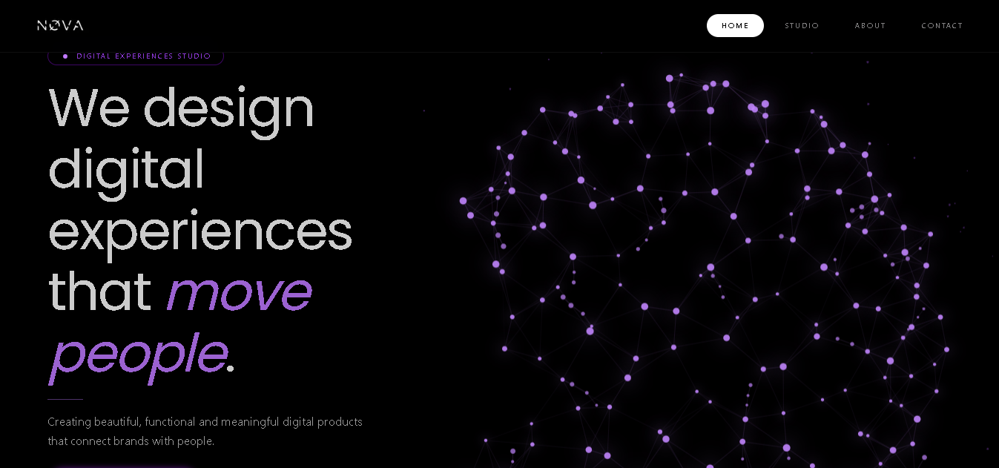
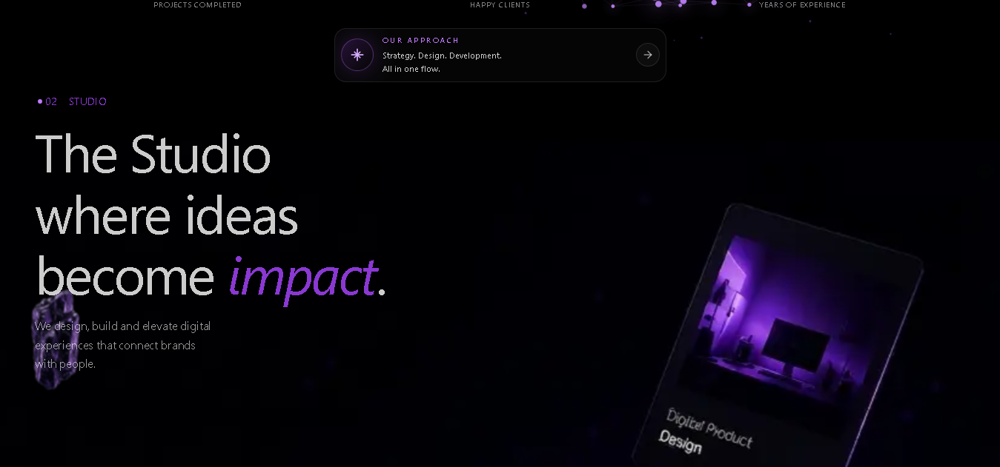
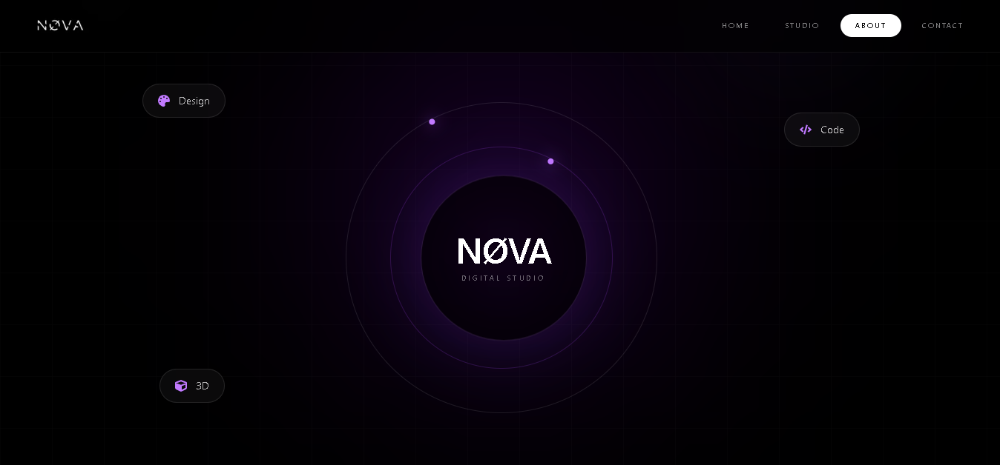
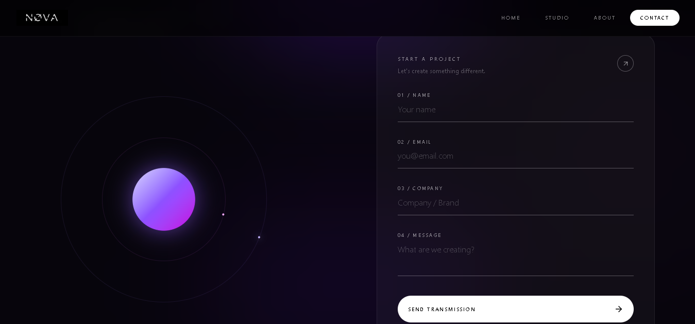

# ✦ NØVA

> A futuristic digital studio portfolio focused on immersive interfaces, motion design and experimental web experiences.

<div align="center">

[](#)
[](#)
[](#)
[](#)
[](#)

</div>

---

## 🎬 Demo

A short walkthrough of NØVA showcasing the interface, motion design, navigation and interactive visual experience.

 * Link: [Nova - Studios](https://nova-studios.up.railway.app)

[Video](https://github.com/user-attachments/assets/0943be8e-e28c-4285-b077-95804c3d19a6)

---

## 🖥️ Preview

### Home

<p align="center">
  
</p>

### Studio

<p align="center">
  
</p>

### About

<p align="center">
  
</p>

### Contact

<p align="center">
  
</p>

---

# ✦ About

**NØVA** is an experimental digital studio portfolio created to explore the combination of modern frontend technologies, visual design, motion and interactive experiences.

The project focuses on creating a strong digital identity rather than relying on a conventional portfolio layout.

The experience combines:

* Modern UI/UX
* Motion design
* Interactive interfaces
* Canvas rendering
* Visual effects
* Responsive design
* Typography
* Custom animations
* Frontend performance

The visual direction is inspired by futuristic digital studios, using dark surfaces, vibrant accents, atmospheric backgrounds and animated elements.

---

# ✨ Features

## 🌌 Interactive Particle System

One of the main visual elements of NØVA is a custom particle system rendered using HTML Canvas.

The system creates an animated environment composed of:

* Orbital particles
* Connected particle branches
* Ambient particles
* Dynamic movement
* Interactive visual depth
* Animated connections

The particle system is custom-built, allowing the behavior, movement and rendering logic to be controlled directly.

The current implementation uses approximately **180 particles** distributed across different visual behaviors.

---

## 🎞️ Motion Design

Motion is an important part of the NØVA experience.

Animations are implemented using **Framer Motion** and are used for:

* Page entrances
* Element reveals
* Navigation interactions
* Hover states
* Transitions
* Micro-interactions
* Position and opacity changes

The objective is to use animation to reinforce the visual hierarchy of the interface rather than simply adding movement for decoration.

---

## 🎨 Visual Identity

NØVA follows a futuristic visual language built around:

* Dark backgrounds
* Purple accents
* Cyan accents
* High-contrast typography
* Large headings
* Minimal interfaces
* Soft gradients
* Glow effects
* Atmospheric visual elements

The project uses **Manrope** and **Poppins** to create a balance between modern interface typography and expressive headings.

---

# 🧰 Tech Stack

| Technology        | Purpose                                      |
| ----------------- | -------------------------------------------- |
| **Next.js**       | React framework and application architecture |
| **TypeScript**    | Type safety and maintainability              |
| **Tailwind CSS**  | Utility-first styling                        |
| **Framer Motion** | Animations and interactions                  |
| **React Icons**   | Interface icons                              |
| **HTML Canvas**   | Custom particle system                       |
| **Vercel**        | Deployment                                   |

---

# 🏗️ Architecture

NØVA follows a component-based architecture using the Next.js App Router.

The application separates the visual interface into reusable sections and components while keeping animation logic and interactive elements organized independently.

```text
                         NØVA
                          │
             ┌────────────┴────────────┐
             │                         │
          Layout                    Sections
             │                         │
       ┌─────┴─────┐          ┌────────┼────────┐
       │           │          │        │        │
    Navbar       Footer      Home     Studio   About
                                      │
                                      ▼
                                   Contact
                                      │
                          ┌───────────┴───────────┐
                          │                       │
                     Framer Motion          Canvas System
                          │                       │
                          ▼                       ▼
                     UI Motion             Particle System
```

---

# 🌌 Particle System

The particle background is one of the main technical experiments of the project.

Its responsibility is to manage the creation, movement and rendering of particles inside a Canvas environment.

The conceptual flow is:

```text
Particle System
      │
      ├── Particle creation
      │
      ├── Position updates
      │
      ├── Movement calculations
      │
      ├── Distance calculations
      │
      ├── Connection generation
      │
      └── Canvas rendering
```

The system is separated from the normal React UI rendering process, allowing the visual background to operate independently from most interface updates.

---

# 🎞️ Animation Architecture

NØVA uses Framer Motion as the main animation library.

A simplified interaction flow looks like:

```text
User Interaction
       │
       ▼
React Component
       │
       ▼
Framer Motion
       │
       ├── Opacity
       ├── Position
       ├── Scale
       ├── Transform
       └── Transitions
       │
       ▼
Animated Interface
```

This allows motion to remain integrated with the component architecture rather than being handled as isolated visual effects.

---

# 📂 Project Structure

```text
NOVA/
│
├── public/
│
├── src/
│   └── app/
│
├── screenshots/
│   ├── Home.png
│   ├── Studio.png
│   ├── About.png
│   └── Contact.png
│
├── package.json
├── tsconfig.json
├── next.config.ts
├── postcss.config.mjs
└── README.md
```

> The structure above represents the main organization relevant to the project documentation.

---

# 📱 Responsive Design

NØVA is designed to provide a responsive experience across different screen sizes.

The interface adapts through:

* Responsive layouts
* Typography scaling
* Navigation changes
* Component resizing
* Mobile-friendly interactions
* Adaptive spacing
* Responsive visual effects

The goal is to preserve the visual identity of NØVA without compromising usability on smaller screens.

---

# ⚡ Performance

The project also serves as an experiment in balancing visual complexity with frontend performance.

The particle system can become CPU/GPU intensive as the number of particles and connection calculations increases.

Performance considerations include:

* Controlling particle count
* Limiting unnecessary calculations
* Optimizing Canvas rendering
* Avoiding unnecessary React re-renders
* Keeping visual calculations independent from React where possible
* Reducing visual complexity on constrained devices

Performance optimization remains an ongoing area of improvement.

---

# 🚀 Getting Started

## 1. Clone the repository

```bash
git clone https://github.com/XantBuildd/NOVA.git

cd NOVA
```

## 2. Install dependencies

```bash
npm install
```

## 3. Start the development server

```bash
npm run dev
```

The application will be available at:

```text
http://localhost:3000
```

---

# 📦 Available Scripts

### Development

```bash
npm run dev
```

Starts the development server.

### Production Build

```bash
npm run build
```

Creates an optimized production build.

### Production Server

```bash
npm run start
```

Starts the production server.

### Lint

```bash
npm run lint
```

Runs the project's linting process.

---

# 🌐 Deployment

NØVA is designed for deployment using **Vercel**.

```text
GitHub
   │
   ▼
Vercel
   │
   ▼
Next.js Build
   │
   ▼
Production
```

---

# 🧠 What I Learned

NØVA was created as an opportunity to explore a more visual and experimental side of frontend development.

Through this project, I worked with:

* Next.js App Router
* TypeScript
* Tailwind CSS
* Framer Motion
* Canvas rendering
* Particle systems
* Motion design
* Interactive backgrounds
* Responsive interfaces
* Component architecture
* Visual hierarchy
* Frontend performance

One of the main challenges was finding a balance between creating a visually complex experience and maintaining a responsive interface.

This project helped me understand that modern frontend development is not only about building functional interfaces, but also about creating experiences where **design, interaction and engineering work together.**

---

# 🔭 Future Improvements

* [ ] Optimize particle rendering
* [ ] Improve mobile particle performance
* [ ] Add reduced-motion support
* [ ] Improve accessibility
* [ ] Add more interactive experiences
* [ ] Experiment with WebGL
* [ ] Add Three.js experiences
* [ ] Improve SEO
* [ ] Optimize bundle size
* [ ] Add detailed project case studies
* [ ] Improve page transitions
* [ ] Add more advanced interactions

---

# 📊 Technical Goals

The long-term goal of NØVA is to evolve into a more immersive digital experience while maintaining performance and usability.

```text
NØVA
 │
 ├── UI / UX
 │
 ├── Motion Design
 │
 ├── Canvas
 │
 ├── WebGL
 │
 ├── Three.js
 │
 └── Interactive Experiences
```

---

# 👨‍💻 Author

**Nicolas**

Computer Systems Engineering Student
Frontend / Full-Stack Developer

### Connect with me

* GitHub: [@XantBuildd](https://github.com/XantBuildd)
* LinkedIn: [linkedin.com/in/xantb-nicolas](https://www.linkedin.com/in/xantb-nicolas)

---

<div align="center">

## ✦ NØVA

**Digital experiences beyond the ordinary.**

Built with Next.js, TypeScript, Framer Motion and Canvas.

⭐ If you found the project interesting, consider giving it a star.

</div>
